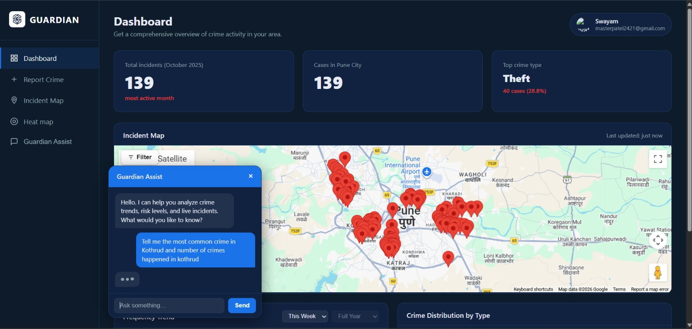
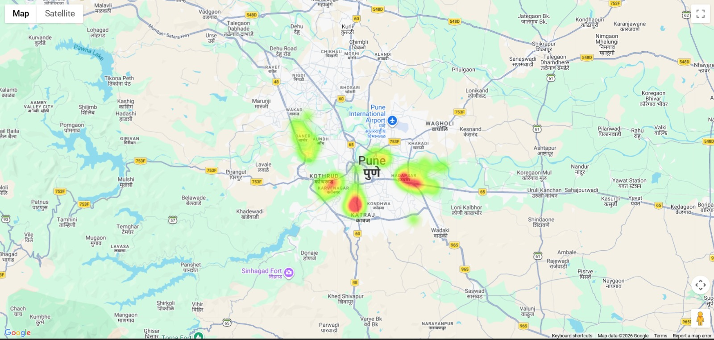
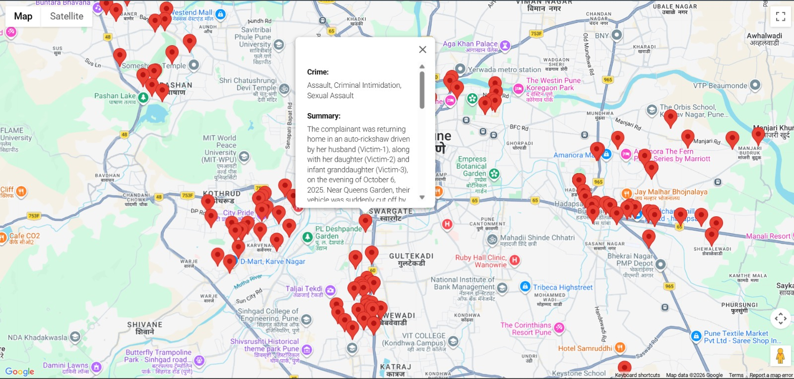

# 🚨 Guardian — AI-Powered FIR Crime Mapping System

Guardian is an end-to-end crime processing, geocoding, and visualization system that extracts information from FIR PDFs, stores them in a Supabase database, converts location text into latitude/longitude using MapMyIndia Geocoding API, and finally plots all crime points on an interactive map using Mappls Maps.

# ✨ Features
🔍 1. Automated FIR Extraction
- Reads FIR PDF files
- Extracts key details using AI (LangChain+Gemini)
- Stores structured results into Supabase
- Handles complainant, accused, sections, summary, etc.

🗺️ 2. Intelligent Geocoding
- Converts FIR location text → Latitude/Longitude
- MapMyIndia Geocoding API
- Urban bias + Sublocality filter for accuracy
- Automatic retries + error handling
- Stores coordinates back into Supabase

📌 3. Interactive Crime Map (Frontend)
- Plots each FIR on Mappls Maps
- Custom markers
- Popup box shows:
- Crime Category
- Incident Summary
- Scrollable popup for long content
- Clean UI

⚙️ 4. FastAPI Backend
- /api/fir-data endpoint returns all FIR geocoded entries
- Clean SQLAlchemy ORM-based CRUD
- Connected directly to Supabase PostgreSQL

## 🎨 UI/UX Preview

Guardian features a modern crime intelligence interface designed for real-time monitoring, spatial crime analysis, and AI-assisted investigation workflows. Below are the core interface mockups integrated into the platform.

---

### 🖥️ Smart Dashboard + AI Chatbot

The central dashboard provides a consolidated overview of FIR analytics, crime insights, and operational monitoring. An integrated AI chatbot enables natural-language interaction with FIR records, helping users quickly retrieve summaries, crime statistics, and investigation-related information.

**Key Highlights**
- Real-time FIR statistics
- Crime category visualization
- AI-powered conversational assistant
- Incident monitoring panels
- Interactive analytics widgets

---

### 🔥 Crime Heatmap Visualization

The heatmap module visualizes crime density across geographical regions, enabling rapid identification of hotspots and high-risk zones.

**Key Highlights**
- Spatial crime density analysis
- Hotspot detection
- Region-wise crime concentration
- Dynamic visual overlays
- Improved situational awareness

---

### 🗺️ Interactive Crime Mapping Interface

The interactive map displays geocoded FIR incidents with detailed markers and popup-based incident summaries for efficient navigation and investigation.

**Key Highlights**
- Real-time FIR plotting
- Interactive incident markers
- FIR detail popups
- Location-based navigation
- Clean and responsive map UI

# 🛠️ Technologies Used
- Python
- LangChain + Gemini
- Supabase PostgreSQL
- SQLAlchemy ORM
- FastAPI
- Google Maps API
- HTML + JS Frontend